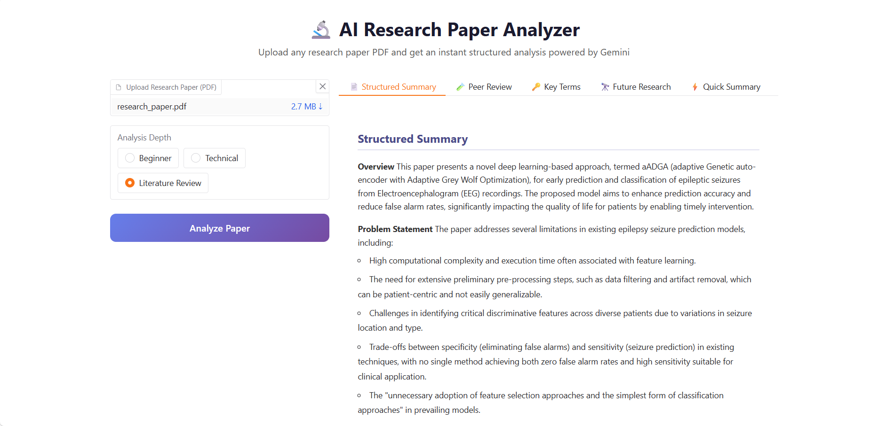

# 🔬 AI Research Paper Analyzer

<div align="center">

<!-- TODO: Add project logo (e.g., an icon representing AI, research, or analysis) -->

[](https://github.com/nidhi-shree/AI-research-paper-analyzer/stargazers)
[](https://github.com/nidhi-shree/AI-research-paper-analyzer/network)
[](https://github.com/nidhi-shree/AI-research-paper-analyzer/issues)
[](LICENSE) <!-- TODO: Add LICENSE file if not present -->

**An AI-powered web application to effortlessly summarize, analyze, and peer-review research papers using the Gemini API and Gradio.**

<!-- TODO: Add Live Demo Link if deployed -->
<!-- [Live Demo](https://demo-link.com) -->

</div>

## 📖 Overview

The AI Research Paper Analyzer is a powerful tool designed to streamline the process of understanding complex research papers. Built with Python, it leverages the cutting-edge capabilities of the Google Gemini API to provide deep insights from any uploaded PDF document.

Researchers, students, and academics can quickly obtain structured summaries, critical peer reviews, identify key terms, and explore future research directions, all presented through an intuitive Gradio web interface. This project aims to save valuable time and enhance comprehension of scientific literature.

## ✨ Features

-   **📄 PDF Upload & Processing:** Easily upload any research paper in PDF format.
-   **📝 Structured Summary:** Get a concise, organized summary of the entire paper.
-   **🔎 Peer Review Simulation:** Receive a simulated peer review highlighting strengths and weaknesses.
-   **🔑 Key Term Extraction:** Automatically identify and list the most important terms and concepts.
-   **🔮 Future Research Directions:** Discover potential avenues for future studies based on the paper's content.
-   **⚡ Quick Summary:** A brief, high-level overview for rapid understanding.
-   **🌐 Intuitive Web Interface:** Powered by Gradio for a user-friendly experience directly in your browser.

## 🖥️ Screenshots





## 🛠️ Tech Stack

**Core Technologies:**


**Libraries:**
-   **`google-generativeai`**: Python client for interacting with the Google Gemini API.
-   **`pypdf`**: Used for extracting text content from PDF documents.
-   **`ipywidgets`**: For interactive elements within the Jupyter Notebook environment.

## 🚀 Quick Start

Follow these steps to get the AI Research Paper Analyzer up and running on your local machine.

### Prerequisites
-   **Python 3.x** (preferably Python 3.8 or newer)
-   **Google API Key**: An API key from the Google Cloud Platform with access to the Gemini API. You can get one from the [Google AI Studio](https://makersuite.google.com/app/apikey).

### Installation

1.  **Clone the repository**
    ```bash
    git clone https://github.com/nidhi-shree/AI-research-paper-analyzer.git
    cd AI-research-paper-analyzer
    ```

2.  **Create a virtual environment (recommended)**
    ```bash
    python -m venv venv
    source venv/bin/activate # On Windows use `venv\Scripts\activate`
    ```

3.  **Install dependencies**
    ```bash
    pip install gradio google-generativeai pypdf ipywidgets
    ```
    *(Note: While `ipywidgets` is listed, it might be automatically handled by Jupyter. Ensure `gradio` and `google-generativeai` are installed for core functionality.)*

4.  **Environment setup**
    Create a `.env` file in the project root to store your Google API Key.
    ```bash
    cp .env.example .env # Create this file if it doesn't exist.
    ```
    Open the newly created `.env` file and add your Gemini API Key:
    ```
    GOOGLE_API_KEY="YOUR_GOOGLE_GEMINI_API_KEY"
    ```

### Run the Application

1.  **Start Jupyter Notebook**
    Navigate to the project directory in your terminal and start Jupyter Notebook:
    ```bash
    jupyter notebook
    ```

2.  **Open the Notebook**
    In the Jupyter interface, open the `AI_Research_Paper_Summarizer (2).ipynb` file.

3.  **Execute the Notebook Cells**
    Run all the cells in the notebook. The Gradio application will launch directly within the notebook output, providing a local URL (e.g., `http://127.0.0.1:7860`) and potentially a public shareable URL.

4.  **Open your browser**
    Visit the provided local URL (e.g., `http://127.0.0.1:7860`) in your web browser to interact with the AI Research Paper Analyzer.

## 📁 Project Structure

AI-research-paper-analyzer/
├── AI_Research_Paper_Summarizer (2).ipynb # Main application notebook containing all code and Gradio interface setup.
└── .env.example # Example file for environment variables.


## ⚙️ Configuration

### Environment Variables
The application requires your Google Gemini API Key to function correctly.

| Variable         | Description                                       | Default | Required |
|------------------|---------------------------------------------------|---------|----------|
| `GOOGLE_API_KEY` | Your API key for accessing the Google Gemini API. | None    | Yes      |

### Configuration Files
The primary configuration is managed through the `.env` file for API keys. All application logic and Gradio interface setup are contained within the `AI_Research_Paper_Summarizer (2).ipynb` Jupyter Notebook.

## 🔧 Development

Development primarily involves working within the `AI_Research_Paper_Summarizer (2).ipynb` notebook.

### Key Sections for Development:
-   **API Integration:** Modifying or extending how the Gemini API is called.
-   **Output Formatting:** Adjusting how the summaries and analyses are presented.
-   **Gradio Interface:** Customizing the look and feel or adding new interactive elements to the Gradio UI.
-   **PDF Processing:** Enhancing or changing the PDF text extraction logic.

## 🤝 Contributing

We welcome contributions to enhance the AI Research Paper Analyzer! Here's how you can help:

1.  **Fork the repository.**
2.  **Create a new branch** (`git checkout -b feature/your-feature-name`).
3.  **Make your changes** in the `AI_Research_Paper_Summarizer (2).ipynb` or add new files.
4.  **Commit your changes** (`git commit -m 'Add new feature'`).
5.  **Push to the branch** (`git push origin feature/your-feature-name`).
6.  **Open a Pull Request.**

Please ensure your code adheres to Python best practices and includes necessary comments.

## 📄 License

This project is licensed under the [LICENSE_NAME](LICENSE) - see the LICENSE file for details. <!-- TODO: Add a LICENSE file (e.g., MIT, Apache 2.0) -->

## 🙏 Acknowledgments

-   **Google Gemini API**: For powering the advanced AI capabilities.
-   **Gradio**: For providing an excellent framework for building web interfaces for ML models.
-   **pypdf**: For robust PDF parsing functionality.

## 📞 Support & Contact

-   🐛 Issues: [GitHub Issues](https://github.com/nidhi-shree/AI-research-paper-analyzer/issues)

---

<div align="center">

</div>
